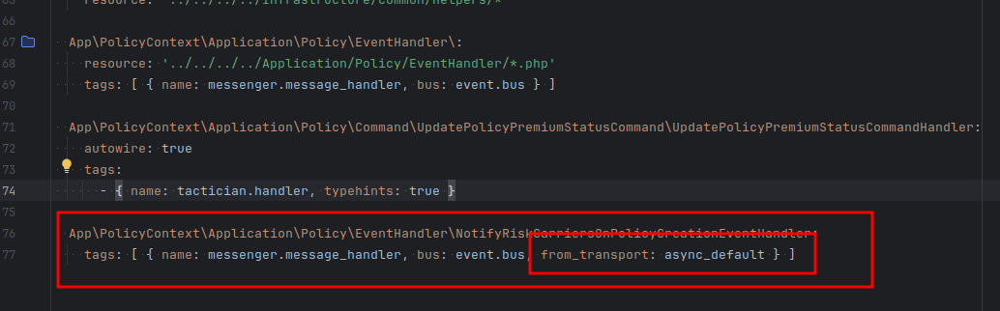

SETUP:

make up en dev-environment
enter in locakstack container
aws configure
    AWS_KEY=LOCALSTACK_FAKE_ACCESS_KEY_ID
    AWS_SECRET=LOCALSTACK_FAKE_ACCESS_KEY
    AWS_REGION=eu-west-1
Comandos:

* LISTAR COLAS:  aws --endpoint-url=http://localstack:4566 --region=eu-west-1 sqs list-queues
* LISTAR LOS FilterPolicy del AWS::SNS::Subscription: aws --endpoint-url=http://localstack:4566 sns get-subscription-attributes --subscription-arn arn:aws:sns:eu-west-1:000000000000:policy-events-dev:942317d0-5dfd-49e3-b09e-446c013e3377 --region=eu-west-1
* CONSUMIR LOS MENSAJES DE LA COLA: aws --endpoint-url=http://localstack:4566 sqs receive-message --queue-url=http://localstack:4566/queue/eu-west-1/000000000000/policy-policy-queue-dev --wait-time-seconds 1 --region=eu-west-1
* list without consuming: aws --endpoint-url=http://localstack:4566 sqs receive-message --queue-url http://localstack:4566/queue/eu-west-1/000000000000/policy-policy-queue-dev --max-number-of-messages 10 --visibility-timeout 0 --region eu-west-1
* purge queue: aws --endpoint-url=http://localstack:4566 sqs purge-queue --queue-url http://localstack:4566/queue/eu-west-1/000000000000/policy-policy-queue-dev --region eu-west-1


consume los mensajes de la cola

 aws --endpoint-url=http://localstack:4566 sqs receive-message --queue-url=http://localstack:4566/queue/eu-west-1/000000000000/policy-policy-queue-dev --wait-time-seconds 1 --region=eu-west-1

 aws --endpoint-url=http://localstack:4566 sqs receive-message --queue-url="http://localstack:4566/queue/eu-west-1/000000000000/payment-payment-queue-dev" --wait-time-seconds 1 --region=eu-west-1


lista las colas 

aws --endpoint-url=http://localstack:4566 --region=eu-west-1 sqs list-queues


# entorno dev
 
configuracion:

* localstack-cli
    * cloudformation.yaml
* localstack

lifeCycle:

1. localstack-cli carga la configuracion en localstack
1. los eventos del servicio en concreto a traves del eventBus publica ( a nivel de infra es messenger ) el evento.
    1. Esta configurado en config/packages/menssenger.yaml

```
 framework:
    messenger:
        default_bus: event.bus
        failure_transport: dead_letter
        buses:
            event.bus:
                default_middleware: "allow_no_handlers"
                middleware:
                    - doctrine_ping_connection
                    - domain_events.middleware.add_sns_message_attributes
                    - domain_events.middleware.stamp_history_cleaner
        transports:
            sync: #messenger wil find all the handlers with the method invoke(-->>EventName<<-- $event) in runtime and will execute it
                dsn: 'sync://'
                serializer: domain_events.serializer
            async_default: #messenger wil publish in the queue configured.  in our case our aws sqs queue
                dsn: 'enqueue://default?topic[name]=%env(POLICY_EVENTS_TOPIC)%&queue[name]=%env(POLICY_POLICY_QUEUE)%&receiveTimeout=3'
                retry_strategy:
                    max_retries: 5
                    delay: 10000
                    multiplier: 2
                    max_delay: 900000
                serializer: domain_events.serializer
            dead_letter:
                dsn: "%env(MESSENGER_TRANSPORT_DSN)%"
                options:
                    table_name: "messenger_dead_letter"
                    queue_name: "dead_letter"

        routing:
            Isurance\SharedContextBundle\Domain\Event\DomainEvent: [sync, async_default]
```

Entonces cada handler configurado puedes elegir si manejarlo de forma sincrona o asincrona

```
App\PaymentContext\Application\Payment\EventHandler\CreatePaymentInPspOnPaymentCreated:
    tags: [ { name: messenger.message_handler, bus: event.bus, from_transport: async_domain_events } ]

```


* entorno stg/pre/prod
    * cicd/terraform/infra-ecs/queue.tf
    * cicd/terraform/infra-ecs/topic.tf

hay un archivo de estado en aws y cuando terraform se ejecuta el plan te hace una comparativa entre el actual y lo nuevo

palabra clave en el log del pipe "destroy and then create replacement" dentro del "speculative Plan"

cada vez que se hace un deploy se crea la infra de los topic y colas.

Preguntas:

1. Entiendo que si ya existe o no se ha cambiado lo deja igual
1. no deberiamos usar el mismo terraform para cargar en el localstack?


https://docs.localstack.cloud/user-guide/integrations/terraform/


hay un comando en src/command en policyService para publicar el evento que quieras en localstack

redefine el transporte porque symfony deja la config mas especifica



Para logear en orchestrator o a nivel de aplicacion

use Isurance\Logger\Infrastructure\Service\Logger\AppLog;
use Isurance\Logger\Infrastructure\Service\Logger\BolttechLogger;
$this->logger->warning(AppLog::create("",[context]));